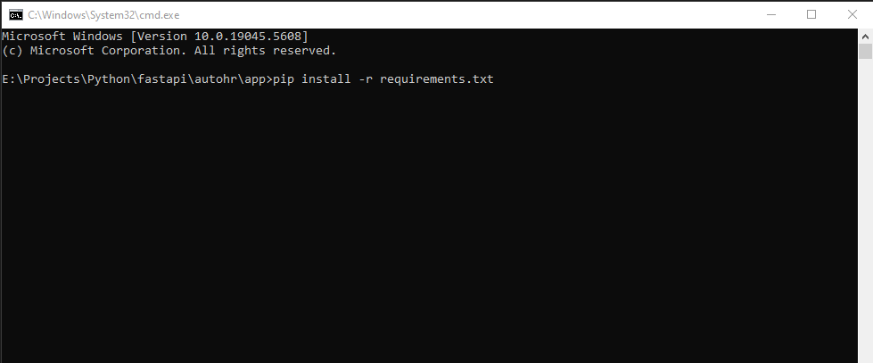
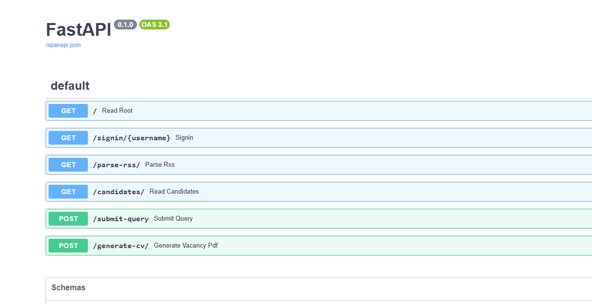
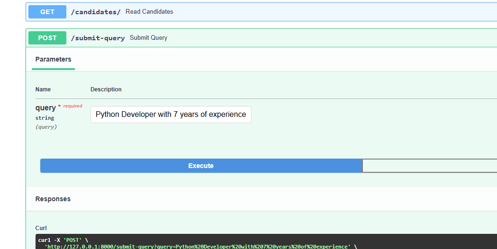
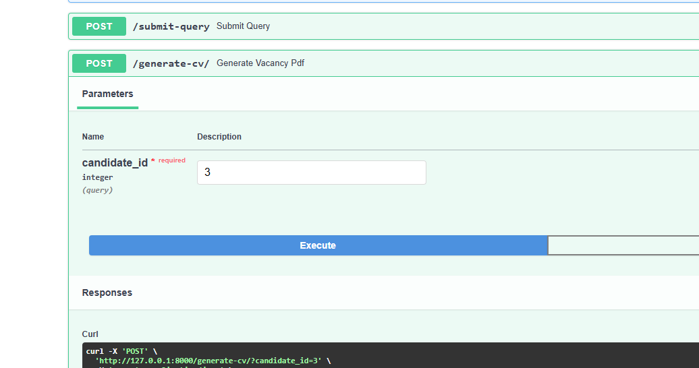

================ About this system ==============

Summary: 
Backend developer for "CVGenix" (Updated version with input data)

Title:
Development of an API for processing candidate requests with data parsing and PDF generation

Description:

We are creating a platform for automating HR processes and are looking for a smart, resourceful developer to build a reliable backend. Your task is to implement an API in Python (FastAPI), which:

1. Accepts a request from a user, parses it and searches for candidates in data received from an external source.

2. Uses PostgreSQL to store and process data.

3. Generates a PDF file with the selected candidate's data.

As a data source, use the RSS feed of vacancies from 

https://jobs.dou.ua/vacancies/feeds/?category=Python 

(vacancies for Python developers). We want to see your skills in working with databases, parsing external data and generating documents, as well as the ability to write clean and structured code. 

Requirements: 
1. Setting up the environment and database: 
o Use Python 3.8+ and FastAPI. 
o Set up PostgreSQL (locally or via Docker) with the candidates table for storing data. Table structure: 
 id (integer, autoincrement, primary key), 
 name (varchar, candidate name, e.g. "Python Developer"), 
 skills (varchar, skills from job description, e.g. "Python, Django"), 
 experience (varchar, experience in years, e.g. "3-5 years"), 
 source (varchar, source, fixed "dou.ua"). 
o Write a script that: 
 Downloads RSS feed from https://jobs.dou.ua/vacancies/feeds/?category=Python. 
 Parses XML and extracts data about vacancies (e.g. <title> for name, <description> for skills and experience). 
 Populates candidates table with at least 5-10 records on startup. Example data from RSS: 
 <title>: "Senior Python Developer at CoolCompany". 
 <description>: "Requires 3+ years of experience with Python, Django, knowledge of SQL". 
2. Endpoint for processing the request (/submit-query): 
o Method: POST. 
o Input data: JSON with a query field (e.g. {"query": "Python developer with 3+ years"}). 
o Logic: 
 Write a query parsing function that extracts keywords (e.g. "Python", "3+ years") - just split the string into words and look for matches. 
 Use the candidates table in PostgreSQL as a data source: 
 Search for candidates whose skills contain at least one word from the query (WHERE skills ILIKE '%Python%'). 
 Filter by experience: if "X+ years" is specified, select candidates with experience ≥ X (parse the number from experience). 
 Limit the result to 5 candidates. 
o Output: JSON with an array of candidates. Example: 
[ 
{"id": 1, "name": "Senior Python Developer", "skills": "Python, Django", "experience": "4 years", "source": "dou.ua"}, 
{"id": 2, "name": "Python Engineer", "skills": "Python, Flask", "experience": "3 years", "source": "dou.ua"} 
] 
o Requirement: Demonstrate competent work with the DB (efficient SQL queries, indexes for skills or experience, if necessary). 
3. Endpoint for generating PDF (/generate-cv): 
o Method: POST.
o Input: JSON with candidate_id field (e.g. {"candidate_id": 1}). 
o Logic: 
 Extract candidate data from candidates table by id. 
 Generate PDF with: 
 Header: "Resume for [Name]" (e.g. "Resume for Senior Python Developer"). 
 Fields: "Skills: [skills]", "Experience: [experience]", "Source: [source]". 
 Formatting: Times New Roman or Arial font, size 12, 20px top and left margins. 
 Use reportlab (or FPDF). 
o Output: PDF file as application/pdf named resume_[name].pdf (e.g. resume_Senior_Python_Developer.pdf). 
4. Technical details: 
o Use requests and xml.etree.ElementTree to load and parse RSS. 
o Use SQLAlchemy or psycopg2 to work with PostgreSQL. 
o Handle errors: if candidate is not found - 404 with "Candidate not found". 
o Structure the code: separate modules for RSS parsing, DB work and PDF. 
o Add comments to key parts (e.g. how you parse RSS or SQL)

================ Getting started ================

1. Config the environment
    
    - Run the below cmd to install dependencies for python on the command prompt.
    
    `pip install -r requirements.txt`

    

    - Install the postgresql and get db url (can check in the .env.example file)
        
        `DATABASE_URL=postgres://{user}:{password}@{hostname}:{port}/{database-name}`
    
    - install database / create table

        CREATE TABLE candidates (
            id SERIAL PRIMARY KEY,
            name VARCHAR(255),
            skills VARCHAR(255),
            experience VARCHAR(255),
            source VARCHAR(255) DEFAULT 'dou.ua'
        );
        
    

2. Usage apis

    - `get: /parse-rss`

        This api parse the rss feeds from `https://jobs.dou.ua/vacancies/feeds/?category=Python`

    - `get: /candidates`

        This api will display all of the candidates from Database

    - `post: /submit-query`

        This api contains functionality to filter by query(condition)

        Example of query: 
            
            Python Developer with 7 years of experience
            Python Developer with 7+ years of experience
            ... ... ...

        

    - `post: /generate-cv`

        This api makes the PDF file with candidate's information.

        Example of query:

            Number(1, 2, 3, ... ... ...)

        